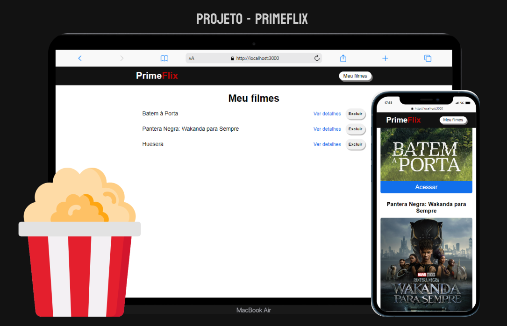

<h1 align="center"> Delivery Pizzaria</h1>

Projeto criado na aula de ReactJs, promovido pelo Sujeito Programador para ensino de tecnologias WEB.

  <a href="#-tecnologias">Tecnologias</a>&nbsp;&nbsp;&nbsp;|&nbsp;&nbsp;&nbsp;
  <a href="#-projeto">Projeto</a>&nbsp;&nbsp;

 

  

## 🚀 Tecnologias

Esse projeto foi desenvolvido com as seguintes tecnologias:

- ReactJs
- Git e Github
 

## 💻 Projeto

Essa aplicação tem como propósito, mostrar um catálago dos últimos 20 filmes lançados. Você poderá salvar um filme que deseja assistir e também assistir ao trailer.

[🔗 Clique aqui para acessar](https://projetoflix-api.vercel.app/)

---

Feito com ♥ by Daniel Kyochi 🌍

